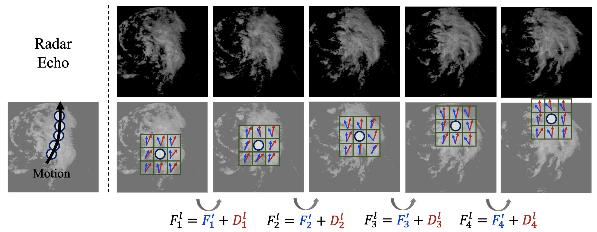
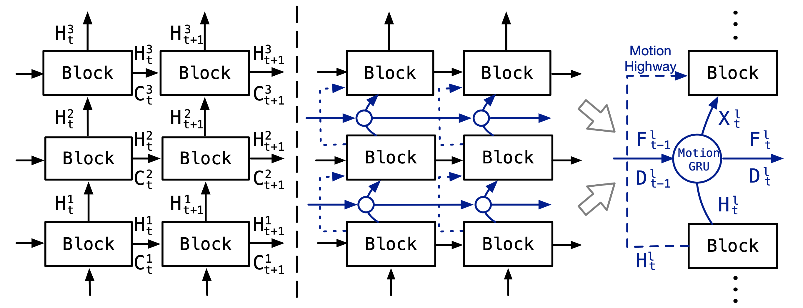
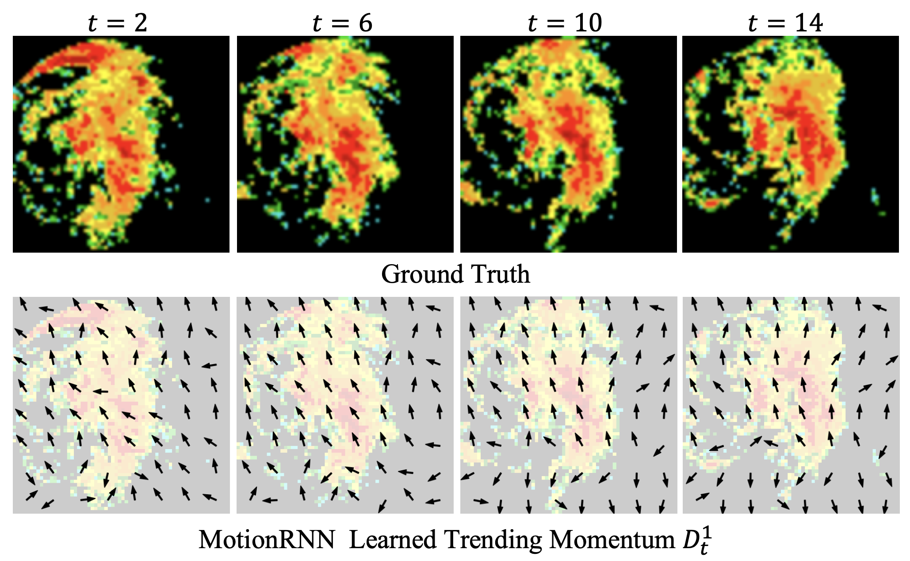

# MotionRNN (CVPR 2021)
MotionRNN: A Flexible Model for Video Prediction with Spacetime-Varying Motions

Different from previous models that focus on temporal state-transition modeling, MotionRNN attempts to model the patch-wise motion explicitly. Concretely, MotionRNN is featured by:

- **Explicit motion modeling.** MotionRNN tries to learn the motion direction and distance for each patch, which can response to the complex spatiotemporal vairations quickly.
- **Motion decomposition.** We present the **MotionGRU** unit to capture the transient variation and motion trend.
- **Flexible framework.** MotionGRU can be embedded into previous models (e.g. ConvLSTM or PredRNN) with the help of **Motion Highway**, which can trade off moving and unchanged parts.



## MotionRNN

Comparison between previous station-transition methods (left) and MotionRNN (right).

To tackle the challenge of spacetime-varying motions modeling, the MotionRNN framework incorporates the MotionGRU unit between the stacked layers as an operator without changing the original state transition flow.



## Get Started

1. Install Python 3.6, PyTorch 1.9.0 for the main code.
2. Download data. You can download the Human dataset following the instruction from [here](https://github.com/Yunbo426/MIM). More datasets can be obtained from [here](https://github.com/thuml/predrnn-pytorch).

3. Train and evaluate the model.
```
cd human_script/
bash MotionRNN_PredRNN_human_train.sh
```

## Learned Motion visualization

The center arrows show a moving up and anticlockwise rotation. The bottom arrows indicate the downward-motion of a cyclone’s small tile.



## Citation

If you find this repo useful, please cite our paper. 

```
@inproceedings{wu2022MotionRNN,
  title={MotionRNN: A Flexible Model for Video Prediction with Spacetime-Varying Motions},
  author={Haixu Wu and Zhiyu Yao and Jianmin Wang and Mingsheng Long},
  booktitle={CVPR},
  year={2021}
}
```

## Contact

If you have any questions or want to use the code, please contact whx20@mails.tsinghua.edu.cn.
